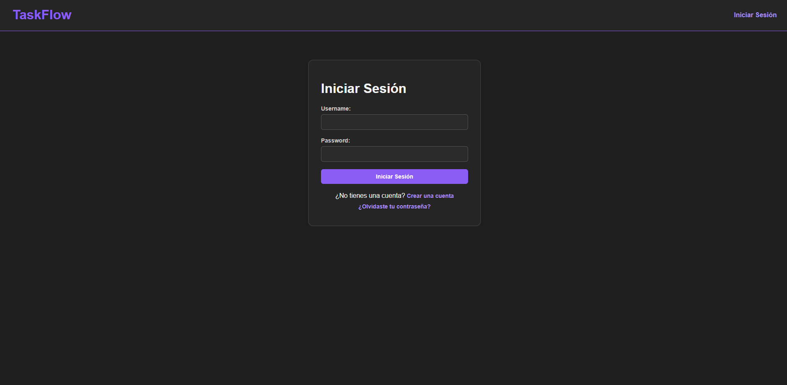
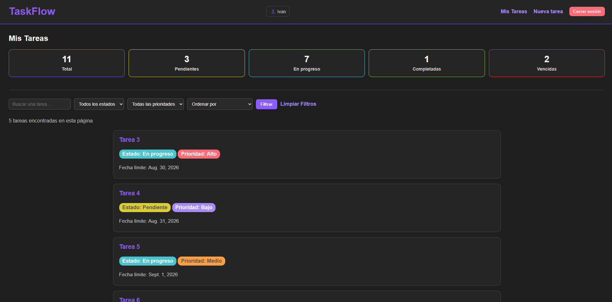
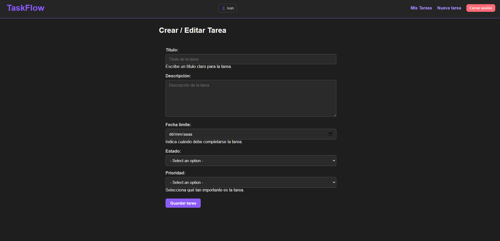
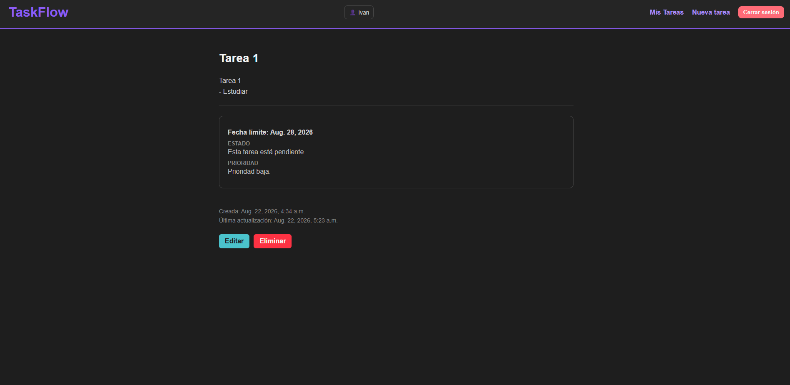

# TaskFlow

TaskFlow es una aplicación web de gestión de tareas desarrollada con Django.
Permite a los usuarios crear, consultar, editar y eliminar sus propias tareas,
además de utilizar búsqueda, filtros, ordenamiento, estadísticas y autenticación.

## Características

- Registro de usuarios
- Inicio y cierre de sesión
- Recuperación de contraseña
- CRUD de tareas
- Estados y prioridades
- Fechas límite
- Validaciones de negocio
- Búsqueda y filtros
- Ordenamiento
- Estadísticas de tareas
- Paginación
- Mensajes de confirmación
- Diseño responsive
- Tests automatizados
- Aislamiento de tareas por usuario

## Tecnologías

- Python
- Django 6.1
- MySQL
- HTML5
- CSS3
- Git
- GitHub
- Django TestCase

## Estructura del proyecto

```text
TaskFlow/
│
├── apps/
│   └── tasks/
│       ├── migrations/
│       ├── templates/
│       ├── static/
│       ├── forms.py
│       ├── models.py
│       ├── tests.py
│       ├── urls.py
│       └── views.py
│
├── config/
│   ├── settings.py
│   ├── urls.py
│   ├── asgi.py
│   └── wsgi.py
│
├── templates/
├── manage.py
├── requirements.txt
├── .gitignore
└── README.md


## Testing

TaskFlow cuenta con pruebas automatizadas utilizando el sistema de testing
de Django.

Las pruebas cubren:

- Modelos y propiedades personalizadas.
- Validaciones de formularios.
- Registro de usuarios.
- Autenticación.
- Autorización y aislamiento de tareas.
- Búsqueda y filtros.
- Ordenamiento.
- Estadísticas.
- Reglas de negocio.


## Instalación

### 1. Clonar el repositorio

```bash
git clone https://github.com/IvanEmmanuel/TaskFlow.git
cd TaskFlow
```

### 2. Crear el entorno virtual

```bash
python -m venv env
```

En Windows:

```bash
env\Scripts\activate
```

### 3. Instalar las dependencias

```bash
pip install -r requirements.txt
```

## Configuración

TaskFlow utiliza variables de entorno para configurar la conexión con MySQL.

Crea un archivo `.env` en la raíz del proyecto:

```env
DB_NAME=taskflow
DB_USER=tu_usuario
DB_PASSWORD=tu_contraseña
DB_HOST=localhost
DB_PORT=3306
```

No subas el archivo `.env` al repositorio. Está incluido en `.gitignore`.

## Base de datos

TaskFlow utiliza MySQL como sistema gestor de base de datos.

Crea una base de datos llamada `taskflow` en MySQL y configura las credenciales correspondientes en el archivo `.env`.

Después ejecuta las migraciones:

```bash
python manage.py migrate
```

## Crear un superusuario

Para acceder al panel administrativo de Django puedes crear un superusuario:

```bash
python manage.py createsuperuser
```

## Ejecutar el proyecto

Inicia el servidor de desarrollo con:

```bash
python manage.py runserver
```

Después abre:

```text
http://127.0.0.1:8000/
```


## Uso

Una vez iniciado el servidor, el usuario puede:

1. Crear una cuenta.
2. Iniciar sesión.
3. Crear nuevas tareas.
4. Consultar sus tareas.
5. Buscar tareas por título.
6. Filtrar tareas por estado y prioridad.
7. Ordenar las tareas.
8. Consultar las estadísticas de sus tareas.
9. Ver el detalle de una tarea.
10. Editar o eliminar sus tareas.
11. Cerrar sesión.
12. Recuperar su contraseña mediante el flujo de recuperación.


## Capturas de pantalla

### Inicio de sesión



### Lista de tareas



### Crear una tarea



### Detalle de una tarea




## Autor

**Iván Emmanuel**

Ingeniero en Sistemas

GitHub: [IvanEmmanuel](https://github.com/IvanEmmanuel)